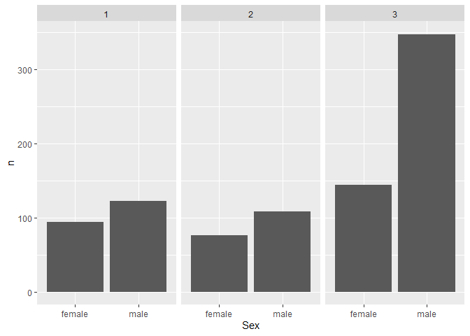

# lab5


``` r
# Load required packages
library(tidyverse)
```

    ── Attaching core tidyverse packages ──────────────────────── tidyverse 2.0.0 ──
    ✔ dplyr     1.1.4     ✔ readr     2.1.5
    ✔ forcats   1.0.0     ✔ stringr   1.5.1
    ✔ ggplot2   3.5.2     ✔ tibble    3.2.1
    ✔ lubridate 1.9.4     ✔ tidyr     1.3.1
    ✔ purrr     1.0.4     
    ── Conflicts ────────────────────────────────────────── tidyverse_conflicts() ──
    ✖ dplyr::filter() masks stats::filter()
    ✖ dplyr::lag()    masks stats::lag()
    ℹ Use the conflicted package (<http://conflicted.r-lib.org/>) to force all conflicts to become errors

``` r
library(knitr)

# Read in the data
titanic <- read_csv("https://raw.githubusercontent.com/nt246/NTRES-6100-data-science/master/datasets/Titanic.csv")
```

    Rows: 891 Columns: 12
    ── Column specification ────────────────────────────────────────────────────────
    Delimiter: ","
    chr (5): Name, Sex, Ticket, Cabin, Embarked
    dbl (7): PassengerId, Survived, Pclass, Age, SibSp, Parch, Fare

    ℹ Use `spec()` to retrieve the full column specification for this data.
    ℹ Specify the column types or set `show_col_types = FALSE` to quiet this message.

``` r
# Let's look at the top 5 lines of the dataset
head(titanic, n = 5) %>%
  kable()
```

| PassengerId | Survived | Pclass | Name | Sex | Age | SibSp | Parch | Ticket | Fare | Cabin | Embarked |
|---:|---:|---:|:---|:---|---:|---:|---:|:---|---:|:---|:---|
| 1 | 0 | 3 | Braund, Mr. Owen Harris | male | 22 | 1 | 0 | A/5 21171 | 7.2500 | NA | S |
| 2 | 1 | 1 | Cumings, Mrs. John Bradley (Florence Briggs Thayer) | female | 38 | 1 | 0 | PC 17599 | 71.2833 | C85 | C |
| 3 | 1 | 3 | Heikkinen, Miss. Laina | female | 26 | 0 | 0 | STON/O2. 3101282 | 7.9250 | NA | S |
| 4 | 1 | 1 | Futrelle, Mrs. Jacques Heath (Lily May Peel) | female | 35 | 1 | 0 | 113803 | 53.1000 | C123 | S |
| 5 | 0 | 3 | Allen, Mr. William Henry | male | 35 | 0 | 0 | 373450 | 8.0500 | NA | S |

``` r
notes <- read_csv("https://raw.githubusercontent.com/nt246/NTRES-6100-data-science/master/datasets/Notes.csv")
```

    Rows: 12 Columns: 3
    ── Column specification ────────────────────────────────────────────────────────
    Delimiter: ","
    chr (3): Variable, Definition, Key

    ℹ Use `spec()` to retrieve the full column specification for this data.
    ℹ Specify the column types or set `show_col_types = FALSE` to quiet this message.

``` r
kable(notes)
```

| Variable | Definition | Key |
|:---|:---|:---|
| PassengerId | Passenger ID | NA |
| Survival | Survival | 0 = No, 1 = Yes |
| Pclass | Ticket class | 1 = 1st, 2 = 2nd, 3 = 3rd |
| Name | Pasenger name | NA |
| Sex | Sex | NA |
| Age | Age in years | NA |
| Sibsp | \# of siblings / spouses aboard the Titanic | NA |
| Parch | \# of parents / children aboard the Titanic | NA |
| Ticket | Ticket number | NA |
| Fare | Passenger fare | NA |
| Cabin | Cabin number | NA |
| Embarked | Port of Embarkation | C = Cherbourg, Q = Queenstown, S = Southampton |

``` r
length(titanic$PassengerId)
```

    [1] 891

``` r
q1 <- titanic |> 
  summarise(survival_count = sum(Survived), dead_count = length(PassengerId)-sum(Survived)) |> 
  mutate(survival_rate = survival_count/(survival_count+dead_count))

kable(head(q1))
```

| survival_count | dead_count | survival_rate |
|---------------:|-----------:|--------------:|
|            342 |        549 |     0.3838384 |

``` r
q2 <- titanic |> 
  count(Sex)

q2
```

    # A tibble: 2 × 2
      Sex        n
      <chr>  <int>
    1 female   314
    2 male     577

``` r
q2.1 <- titanic |> 
  group_by(Pclass) |> 
  count(Sex)

q2.1
```

    # A tibble: 6 × 3
    # Groups:   Pclass [3]
      Pclass Sex        n
       <dbl> <chr>  <int>
    1      1 female    94
    2      1 male     122
    3      2 female    76
    4      2 male     108
    5      3 female   144
    6      3 male     347

``` r
ggplot(data = q2.1, mapping = aes(x = Sex, y = n)) +
  geom_col() +
  facet_wrap(~Pclass)
```


