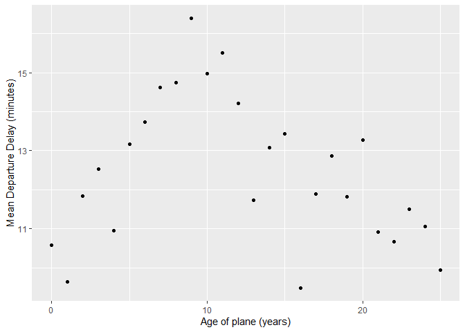
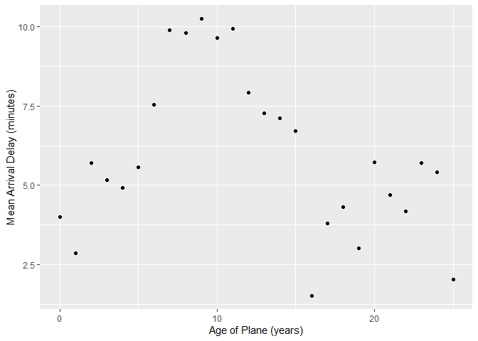
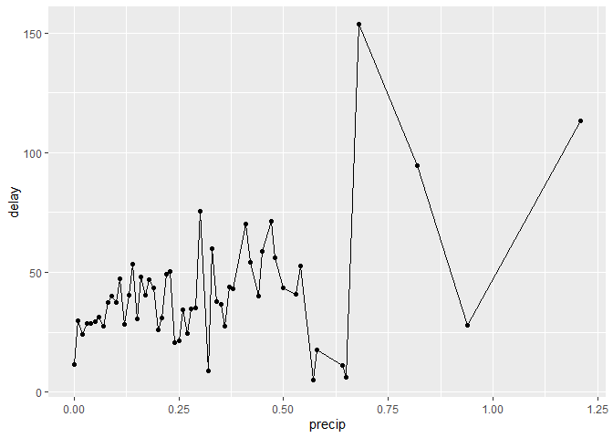
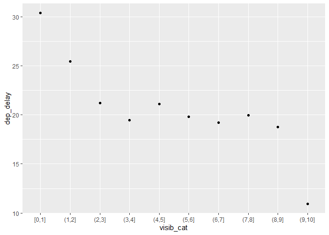
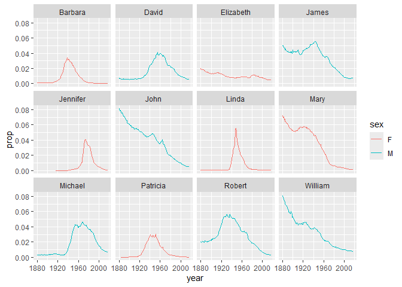
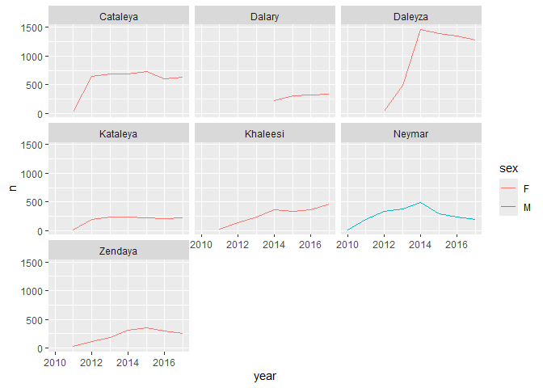
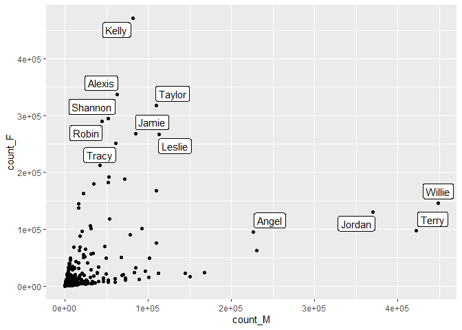
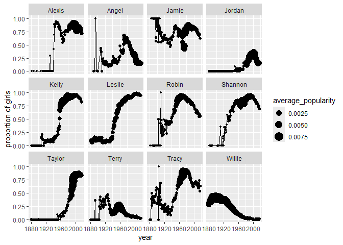

``` r
# Load required packages
library(tidyverse)
```

    ── Attaching core tidyverse packages ──────────────────────── tidyverse 2.0.0 ──
    ✔ dplyr     1.1.4     ✔ readr     2.1.5
    ✔ forcats   1.0.0     ✔ stringr   1.5.1
    ✔ ggplot2   3.5.2     ✔ tibble    3.2.1
    ✔ lubridate 1.9.4     ✔ tidyr     1.3.1
    ✔ purrr     1.1.0     
    ── Conflicts ────────────────────────────────────────── tidyverse_conflicts() ──
    ✖ dplyr::filter() masks stats::filter()
    ✖ dplyr::lag()    masks stats::lag()
    ℹ Use the conflicted package (<http://conflicted.r-lib.org/>) to force all conflicts to become errors

``` r
library(knitr)
library(nycflights13) # install.packages("nycflights13")

flights |> head() |> kable()
```

| year | month | day | dep_time | sched_dep_time | dep_delay | arr_time | sched_arr_time | arr_delay | carrier | flight | tailnum | origin | dest | air_time | distance | hour | minute | time_hour |
|---:|---:|---:|---:|---:|---:|---:|---:|---:|:---|---:|:---|:---|:---|---:|---:|---:|---:|:---|
| 2013 | 1 | 1 | 517 | 515 | 2 | 830 | 819 | 11 | UA | 1545 | N14228 | EWR | IAH | 227 | 1400 | 5 | 15 | 2013-01-01 05:00:00 |
| 2013 | 1 | 1 | 533 | 529 | 4 | 850 | 830 | 20 | UA | 1714 | N24211 | LGA | IAH | 227 | 1416 | 5 | 29 | 2013-01-01 05:00:00 |
| 2013 | 1 | 1 | 542 | 540 | 2 | 923 | 850 | 33 | AA | 1141 | N619AA | JFK | MIA | 160 | 1089 | 5 | 40 | 2013-01-01 05:00:00 |
| 2013 | 1 | 1 | 544 | 545 | -1 | 1004 | 1022 | -18 | B6 | 725 | N804JB | JFK | BQN | 183 | 1576 | 5 | 45 | 2013-01-01 05:00:00 |
| 2013 | 1 | 1 | 554 | 600 | -6 | 812 | 837 | -25 | DL | 461 | N668DN | LGA | ATL | 116 | 762 | 6 | 0 | 2013-01-01 06:00:00 |
| 2013 | 1 | 1 | 554 | 558 | -4 | 740 | 728 | 12 | UA | 1696 | N39463 | EWR | ORD | 150 | 719 | 5 | 58 | 2013-01-01 05:00:00 |

``` r
library(maps) #install.packages("maps")
```


    Attaching package: 'maps'

    The following object is masked from 'package:purrr':

        map

``` r
airports |>
  semi_join(flights, c("faa" = "dest")) |>
  ggplot(aes(lon, lat)) +
    borders("state") +
    geom_point() +
    coord_quickmap()
```


``` r
avg_dest_delays <-
  flights |>
  group_by(dest) |>
  # arrival delay NA's are cancelled flights
  summarise(delay = mean(arr_delay, na.rm = TRUE)) |>
  inner_join(airports, by = c(dest = "faa"))

avg_dest_delays |>
  ggplot(aes(lon, lat, colour = delay)) +
  borders("state") +
  geom_point() +
  coord_quickmap()
```


``` r
plane_cohorts <- inner_join(flights,
  select(planes, tailnum, year),
  by = "tailnum",
  suffix = c("_flight", "_plane")
) |>
  mutate(age = year_flight - year_plane) |>
  filter(!is.na(age)) |>
  mutate(age = if_else(age > 25, 25L, age)) |>
  group_by(age) |>
  summarise(
    dep_delay_mean = mean(dep_delay, na.rm = TRUE),
    arr_delay_mean = mean(arr_delay, na.rm = TRUE)
  )
## Departure delays
ggplot(plane_cohorts, aes(x = age, y = dep_delay_mean)) +
  geom_point() +
  scale_x_continuous("Age of plane (years)", breaks = seq(0, 30, by = 10)) +
  scale_y_continuous("Mean Departure Delay (minutes)")
```



``` r
## Arrival delays
ggplot(plane_cohorts, aes(x = age, y = arr_delay_mean)) +
  geom_point() +
  scale_x_continuous("Age of Plane (years)", breaks = seq(0, 30, by = 10)) +
  scale_y_continuous("Mean Arrival Delay (minutes)")
```



``` r
flight_weather <-
  flights |>
  inner_join(weather, by = c("origin", "year", "month", "day", "hour"))
## Precipitation
flight_weather |>
  group_by(precip) |>
  summarise(delay = mean(dep_delay, na.rm = TRUE)) |>
  ggplot(aes(x = precip, y = delay)) +
  geom_line() + geom_point()
```



``` r
# Visibility
flight_weather |>
  ungroup() |>
  mutate(visib_cat = cut_interval(visib, n = 10)) |>
  group_by(visib_cat) |>
  summarise(dep_delay = mean(dep_delay, na.rm = TRUE)) |>
  ggplot(aes(x = visib_cat, y = dep_delay)) +
  geom_point()
```



``` r
# Load required packages
library(babynames) # install.packages("babynames")

babynames |> head() |> kable()
```

| year | sex | name      |    n |      prop |
|-----:|:----|:----------|-----:|----------:|
| 1880 | F   | Mary      | 7065 | 0.0723836 |
| 1880 | F   | Anna      | 2604 | 0.0266790 |
| 1880 | F   | Emma      | 2003 | 0.0205215 |
| 1880 | F   | Elizabeth | 1939 | 0.0198658 |
| 1880 | F   | Minnie    | 1746 | 0.0178884 |
| 1880 | F   | Margaret  | 1578 | 0.0161672 |

``` r
# number of passengers in the dataset
top_6_names <- babynames |>
  group_by(sex, name) |>
  summarise(total_count=sum(n)) |>
  ungroup() |>
  group_by(sex) |>
  slice_max(order_by = total_count, n = 6)
```

    `summarise()` has grouped output by 'sex'. You can override using the `.groups`
    argument.

``` r
babynames |>
  semi_join(top_6_names, by = c("sex", "name")) |>
  ggplot(aes(x=year, y=prop, group=name, color=sex)) +
  geom_line() +
  facet_wrap(~name)
```



``` r
new_names <- babynames |>
  mutate(threshold = ifelse(year >= 2010, "after", "before")) |>
  group_by(name, threshold) |>
  summarise(total_count = sum(n)) |>
  pivot_wider(names_from = threshold, values_from = total_count, names_prefix = "count_") |>
  mutate_all(~replace(., is.na(.), 0)) |>
  filter(count_before == 0, count_after >=1000) 
```

    `summarise()` has grouped output by 'name'. You can override using the
    `.groups` argument.
    `mutate_all()` ignored the following grouping variables:

``` r
new_names |> 
  kable()
```

| name     | count_after | count_before |
|:---------|------------:|-------------:|
| Cataleya |        4013 |            0 |
| Dalary   |        1174 |            0 |
| Daleyza  |        6023 |            0 |
| Kataleya |        1327 |            0 |
| Khaleesi |        1964 |            0 |
| Neymar   |        2164 |            0 |
| Zendaya  |        1544 |            0 |

``` r
babynames |>
  filter(name %in% new_names$name) |>
  ggplot(aes(x=year, y=n, color=sex)) +
  geom_line() +
  facet_wrap(~name)
```



``` r
unisex_names <- babynames |>
  group_by(name, sex) |>
  summarise(total_count = sum(n)) |>
  pivot_wider(names_from = sex, values_from = total_count, names_prefix = "count_") |>
  filter(!is.na(count_M), !is.na(count_F)) |>
  mutate(total_count=count_M+count_F, f_proportion = count_F / total_count) |>
  filter(f_proportion<0.9, f_proportion>0.1) |>
  arrange(-total_count)
```

    `summarise()` has grouped output by 'name'. You can override using the
    `.groups` argument.

``` r
unisex_names |>
  head(12) |>
  kable()
```

| name    | count_M | count_F | total_count | f_proportion |
|:--------|--------:|--------:|------------:|-------------:|
| Willie  |  448702 |  146148 |      594850 |    0.2456888 |
| Kelly   |   81550 |  471024 |      552574 |    0.8524180 |
| Terry   |  422580 |   96883 |      519463 |    0.1865061 |
| Jordan  |  369745 |  130158 |      499903 |    0.2603665 |
| Taylor  |  109852 |  317936 |      427788 |    0.7432093 |
| Alexis  |   62928 |  336623 |      399551 |    0.8425032 |
| Leslie  |  112689 |  266474 |      379163 |    0.7027954 |
| Jamie   |   85299 |  267599 |      352898 |    0.7582899 |
| Shannon |   51926 |  294878 |      346804 |    0.8502728 |
| Robin   |   44616 |  289395 |      334011 |    0.8664236 |
| Angel   |  226719 |   94837 |      321556 |    0.2949315 |
| Tracy   |   61164 |  250772 |      311936 |    0.8039213 |

``` r
unisex_names |>
  head(12) |>
  ggplot(aes(x=count_M, y=count_F)) +
  ggrepel::geom_label_repel(aes(label=name)) +
  geom_point(data=unisex_names)
```



``` r
babynames |>
  filter(name %in% unisex_names$name[1:12]) |>
  pivot_wider(names_from = sex, values_from = c(n, prop)) |>
  mutate_all(~replace(., is.na(.), 0)) |>
  mutate(total_count=n_F+n_M, f_proportion = n_F / total_count, average_popularity = (prop_F + prop_M)/2) |>
  ggplot(aes(year, f_proportion, group=name)) +
  geom_line() +
  geom_point(aes(size = average_popularity)) +
  facet_wrap(~name) +
  ylab("proportion of girls")
```


