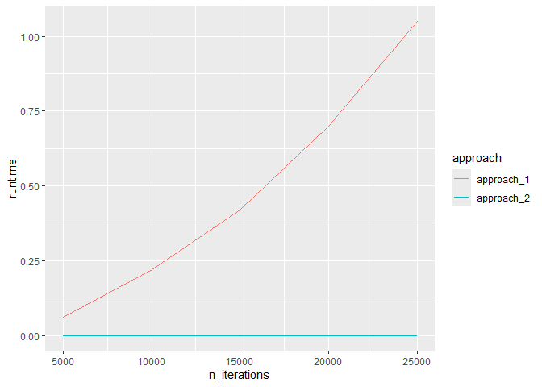

``` r
library(tidyverse)
```

    ── Attaching core tidyverse packages ──────────────────────── tidyverse 2.0.0 ──
    ✔ dplyr     1.1.4     ✔ readr     2.1.5
    ✔ forcats   1.0.0     ✔ stringr   1.5.1
    ✔ ggplot2   3.5.2     ✔ tibble    3.2.1
    ✔ lubridate 1.9.4     ✔ tidyr     1.3.1
    ✔ purrr     1.1.0     
    ── Conflicts ────────────────────────────────────────── tidyverse_conflicts() ──
    ✖ dplyr::filter() masks stats::filter()
    ✖ dplyr::lag()    masks stats::lag()
    ℹ Use the conflicted package (<http://conflicted.r-lib.org/>) to force all conflicts to become errors

``` r
x <- 1:10
y <- 11:20
z <- NULL
for (i in 1:length(x)){
  z <- c(z, x[i] + y[i])
}
z
```

     [1] 12 14 16 18 20 22 24 26 28 30

``` r
n_iterations <- (1:5)*5000
approach_1 <- vector("double", length(n_iterations))
approach_2 <- vector("double", length(n_iterations))

for (i in 1:length(n_iterations)){
  n <- n_iterations[i]
  vector_of_1 <- NULL
  approach_1[i] <- system.time(
    for (j in 1:n){
      vector_of_1 <- c(vector_of_1, 1)
    }
  )[3]
  vector_of_1 <- vector(mode = "double", length=n)
  approach_2[i] <- system.time(
    for (j in 1:n){
      vector_of_1[j] <- 1
    }
  )[3]
}

tibble(n_iterations, approach_1, approach_2) %>%
  pivot_longer(2:3, names_to = "approach", values_to = "runtime") %>%
  ggplot(aes(x=n_iterations, y=runtime, color=approach)) +
  geom_line()
```



``` r
set<-c(letters, " ", ",", "!")
i <- 1
n <- 1000
set.seed(42)
for (i in 1:n){
  if(i==1){
    current_letter <- sample(LETTERS, 1)
    hysterical_monkey <- current_letter
  } else {
    if(last_letter == "!" & i != n){
      current_letter <- str_c(" ", sample(LETTERS, 1))
    } else if(last_letter == "," & i != n){
      current_letter <- str_c(" ", sample(letters, 1))
    } else if(last_letter %in% c(",", "!") & i == n){
      current_letter <- " "
    } else if(last_letter == " "){
      current_letter <- sample(letters, 1)
    } else if (str_count(last_letter) == 2){
      current_letter <- ""
    } else {
      current_letter <- sample(set, 1)
    }
    hysterical_monkey <- str_c(hysterical_monkey, current_letter)
  }
  last_letter <- current_letter
}
```
